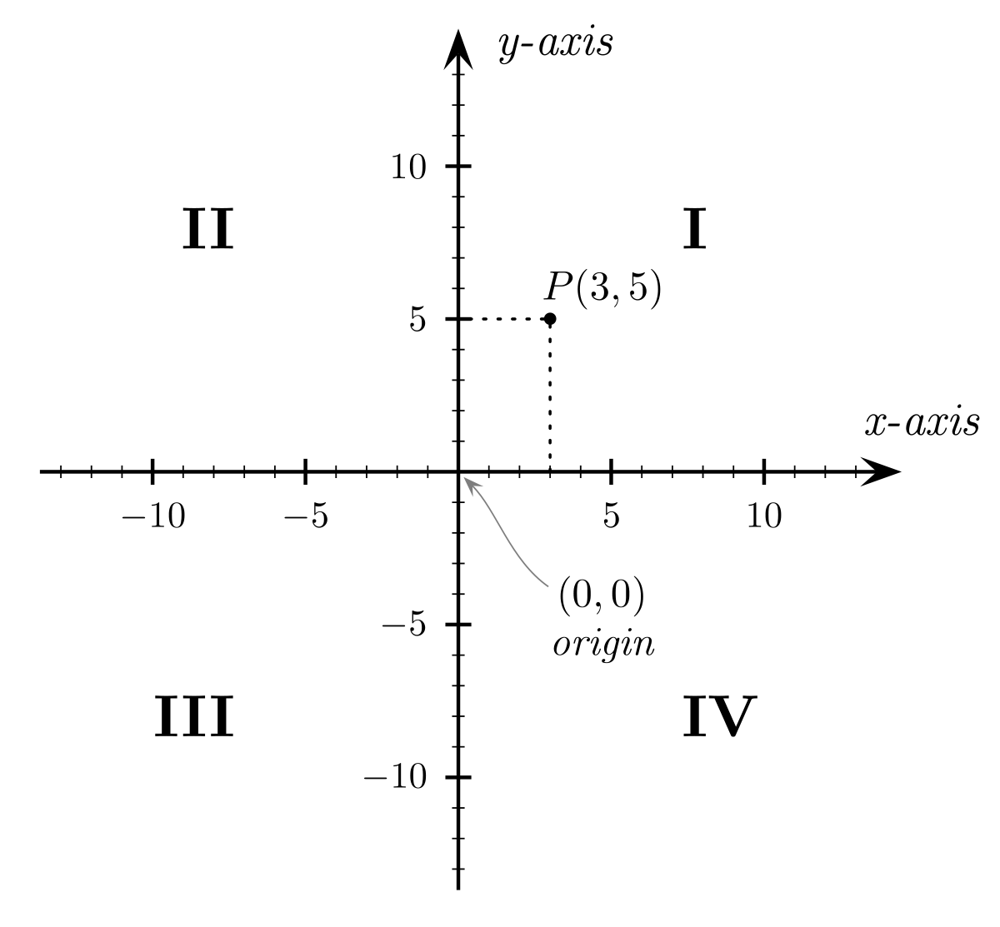

# SpellBook 777

## About

Welcome to SpellBook 777! A simple repository containing markdown and javascript files with brief and deep descriptions of the four elements, planets, and sphere dynamics as used in SpellBook!

The SpellBook app operates on JavaScript, and requires the markdown files in the `/777` folder to be converted into a javascript object. To convert javascript to markdown, have python 3.0 installed and just run `md_to_js.py`.

## What is 777?

777, usually associated with a lucky number in the gambling business, has different meanings - including that of being a table of correspondences and hidden links between symbols, meaning, animals, and taxonomic qualia.

Partly inspired by `Liber 777` and hermetic orders of the western tradition, SpellBook's 777 is an evergreen reference to the mechanics of introspection and inquiry, and the frameworks through which SpellBook operates.

Perhaps the best explanation of 777 rests on the experience of "synchronicities" which are seemingly fortunate happenings, indicative of the human being in **harmonious sync** with the chaotic world at large. The term synchronicity is coined by psychologist **Carl Jung**. To experience synchronicities in life means to be lucky and aligned with larger harmonics. For example: to notice a dove after redirecting your thoughts to ideas of Peace shortly after being triggered by an event, is indeed to win the lottery, isn't it? 777!

To aid in the ordering and categorizing of phenomena, SpellBook requires users to **operate within a basic and simple four-element framework**.

Instead of just jotting down ideas and intuitive inquiries using bullet points or ordered lists, SpellBook asks you to *categorise* all your entries in one of the **four categories** or **four elements**.

The classic four elements are:
- Air
- Fire
- Water
- Earth

But one could also use different concepts and words to represent the four elements, for example using the four directions:
- East
- South
- West
- North

Or, you one could speak of the four quadrants in a cartesian coordinate system:
- Quadrant 1: X positive and Y positive
- Quadrant 2: X negative and Y positive
- Quadrant 3: X negative and Y negative
- Quadrant 4: X positive and Y negative

Perhaps even more curiously, the four elements can be represented by the four seasons:
- Spring
- Summer
- Autumn
- Winter

Together, they form a simple table of correspondences:

| Element | Season | Direction |  X AND Y  | Moon Cycle | SpellBook     |
|:-------:|:------:|:---------:|:---------:|:----------:|---------------|
|     Air | Spring | East      | X+ and Y+ | New Moon   | Possibilities |
|    Fire | Summer | South     | X- and Y+ | Waxing     | Decisions     |
|   Water | Autumn | West      | X- and Y- | Waning     | Work          |
|   Earth | Winter | North     | X+ and Y- | Full Moon  | Results       |

SpellBook 777 provides an essential reference to the four elements and their correspondences, which go broader than the width of your page. What's most interesting about the four elements is their remarkable ability to categorise any life experience on Earth.

However, the story doesn't end at the four elements! Each of the four elements can be divided into four more elements - expanding into a four-by-four elemental framework, creating the basis of **planetary elements**.

Planetary elements, or simply planets, are two-part combinations of the four elements, for example "air of air" or "water of earth". With 16 of these in total, each one expands on the basic correspondences of the four elements to create a truly rich framework to think about life, and in particular, about western culture.

A seperate SpellBook 777 will be created in due time, in the mean-time you can visit the reference by downloading [the app](https://thespellbook.app) from the appropriate stores.

## What is SpellBook?

If you haven't heard of [SpellBook](https://thespellbook.app), I usually introduce it as **Reverse Facebook**. Let that sink in a bit before reading on... what would a reverse facebook constitute?

About 2 in 10 people guess it right. Essentially, Facebook or social media are in the global business of directing your attention outside of yourself and onto *others*. You have the feeling of connecting with your friends and family, while you're being spied on, and spoon-fed an information diet which you have absolutely no control over. The control part isn't as tragic, but the underlying agenda of how your distracting Facebook/IG/Tiktok "feed" is constructed is driven by a corporate agenda having only the best interest of its stakeholders at heart - which isn't you. Every week papers get published showing a fundamental connection between mental health and social media usage, yet we're left with an inconventient dilemma as to the nature of the human being: every human being in the west is in possession of a phone, and with that, you can only reach others through the medium of social media.

The whole notion is a deep tragedy, because as deep as the detrimental effects of  social media convenience go, it's paired with the undeniable march of humanity into deep extinction despite being warned trice- the end of the Anthropocene.

SpellBook then, aims to be an app as conventien as Social Media, but with the agenda of **directing your attention within**.

Humanity seems to believe that space is the last unexplored frontier for the daring, but I beg to differ! The cravices of our endless imagination, and the dynamics of the mind as expressed by DNA itself - that is the last frontier! While multi-billion dollar industries are thriving on fixing humanities mental health problems providing external means to the problem, the origin of our mental health issues is fundamental to our cultural expression, education, upbringing, and epigentically-encoded lineage memory.

SpellBook aims to be a personal journal, and note-taking suite on data tracking and analytic steroids, in an "interactive and social-media like experience", whilst providing 100% privitization of your data and ownership.

SpellBook's aim vision is to provide a PERSONAL SPACE for ordering your mental and emotional well-being, in a chaotic and ever-changing world (with unpredictable weather). Who are you again? Why did you start this project? Why are you feeling bad, or being triggered again? SpellBook aims to provide just-in-time **PERSONAL-INFORMATION** so that you may be yourself until death kicks in. Have you ever open Social Media out of desperation? Those moments of low are what social media thrives on, yet it's those vurnerable moments which are exploited by hooking you into other people's agendas and convictions.

In our upcoming epoch of generated media and AI-assisted psychology nudging, the storm is nigh. Truth, discernment and inquiry ~~will~~ are appropriated and controled by guilt, honor and denial exploitation. Humanity will be confused and policed, perhaps even censored as they're processing their inner anger, bitterness and feelings of injustice.

The only Truth that shall remain is the Truth that you can put in a place where no one else can judge, nudge, or fuck with what's happening in your mind.

Aim to be a loving, unique, untouched, and uninfluenced creator, during times of unprecedented slow-burn excitation.
